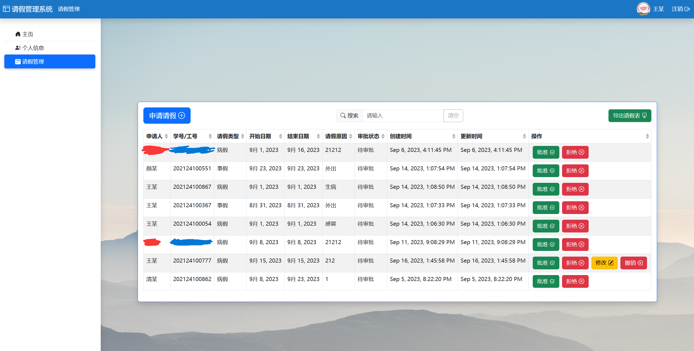

# 请假管理系统-前端

学生请假管理系统的前端部分

## 特色

- 支持登录、登出、修改密码等账号功能
- 支持身份区分（学生/辅导员）
- 支持请假的批准、拒绝、修改与撤销
- 不同学院的请假信息相互隔离
- 支持对请假条目模糊搜索
- 第二次自动登录
- 验证码登录
- 支持手机端访问
- 支持导出 excel 请假表

## 如何使用

使用 shell 命令启动前端，需要配合[后端](https://github.com/APeng215/leave-management-system-backend)使用。

```sh
npm install
npm start
```

## 画廊

